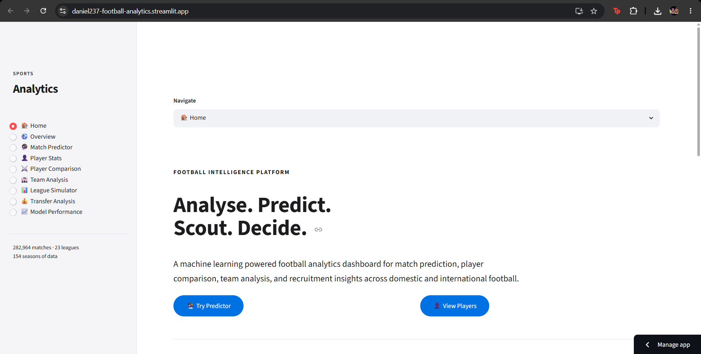
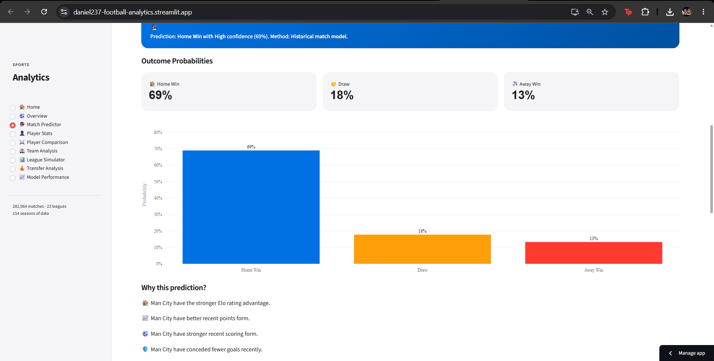
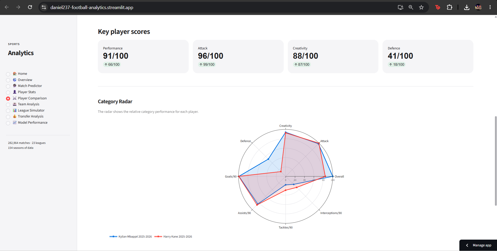
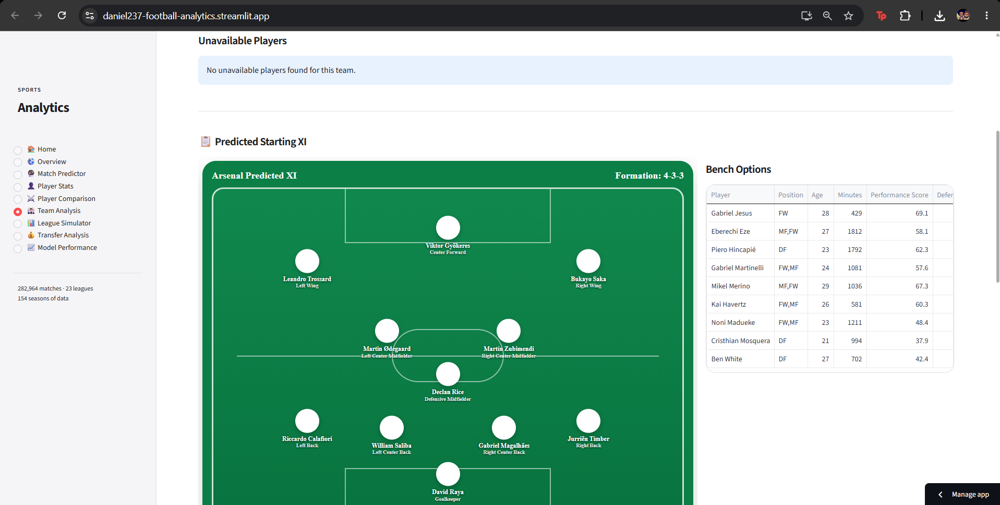
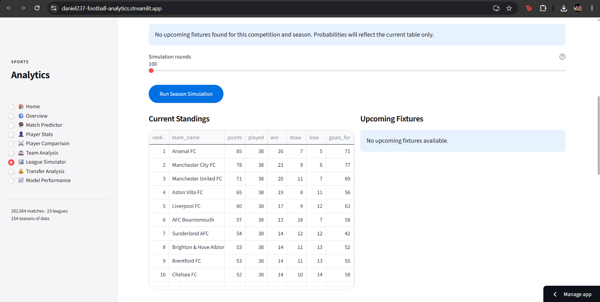
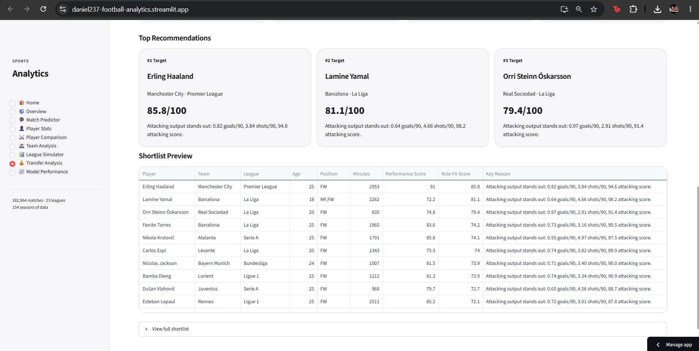
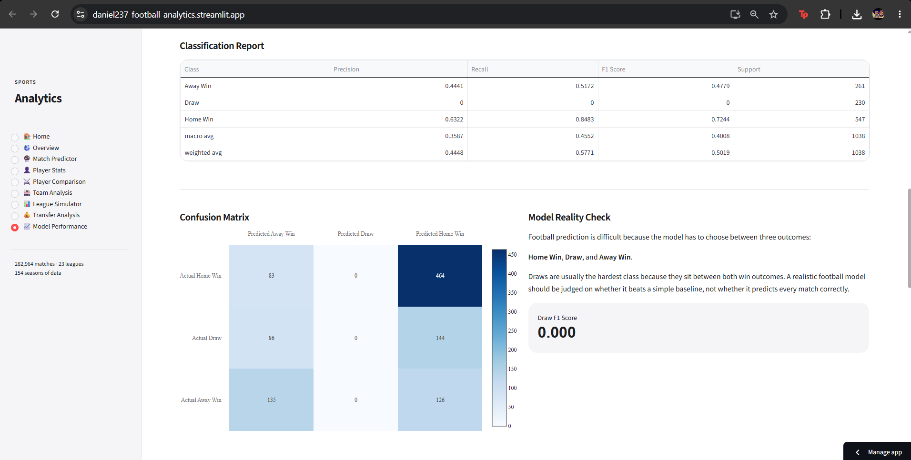

# Football Analytics Platform

An interactive football analytics platform for match prediction, player analysis, squad profiling, recruitment shortlisting, and league table simulation.

The project combines historical football data, machine learning, engineered team-strength features, external football API integrations, and a Streamlit dashboard to turn raw football datasets into practical scouting and performance insights.

**Live app:** https://daniel237-football-analytics.streamlit.app/  
**Repository:** https://github.com/daniel-237/sports-analytics

---

## Overview

Football decisions are often made under uncertainty. Match outcomes depend on form, team strength, injuries, squad quality, home advantage, and random variation. This project explores how football data can be structured, engineered, modelled, and visualised to support better analysis.

The dashboard is designed around realistic football-analysis workflows:

- Predicting match outcomes using machine learning probabilities
- Comparing players using per-90 statistics and performance scoring
- Analysing team form, squad strength, and predicted lineups
- Building recruitment shortlists based on position, role, age, minutes, and performance data
- Simulating league tables using current standings and remaining fixtures
- Integrating external football APIs for standings, fixtures, injuries, and lineups

---

## Core Features

| Area | Feature | Description |
|---|---|---|
| Match prediction | Match Predictor | Predicts Home Win, Draw, or Away Win using historical match features and model probabilities |
| Team strength | Elo ratings | Adds team-strength ratings to improve match context and model explainability |
| Explainability | SHAP explanations | Shows which factors push an individual prediction towards a specific outcome |
| Player analytics | Player Stats | Filters players by league, season, team, position, minutes, goals, assists, and defensive metrics |
| Player comparison | Head-to-head comparison | Compares two players using attacking, creative, defensive, and performance indicators |
| Team analysis | Squad and form analysis | Reviews team form, player output, predicted XI, recent matches, and squad-level KPIs |
| Availability | Injury-aware predicted lineups | Excludes unavailable players from predicted lineups when injury data is available |
| Recruitment | Shortlist Builder | Ranks realistic recruitment targets by position, role fit, performance score, age, and minutes |
| League forecasting | League Simulator | Simulates remaining fixtures to estimate title, top-four, top-six, and relegation probabilities |
| Data pipeline | API integrations | Pulls standings, fixtures, results, injuries, and lineups from football-data.org and API-Football |

---

## Dashboard Pages

### Home

A landing page summarising the project, available data, key metrics, and the main analysis workflows.

### Overview

A high-level view of match coverage, outcome distribution, goal trends, league filters, and historical match patterns.

### Match Predictor

Select a home and away team to generate outcome probabilities. The model uses engineered features such as recent scoring form, conceded goals, clean-sheet rates, failed-to-score rates, points form, Elo strength, streaks, and head-to-head history.

The page also includes model explanation output where available, helping users understand what influenced a prediction.

### Player Stats

Search and filter player data by league, season, team, position, and minutes. Includes attacking, creative, defensive, and per-90 metrics.

### Player Comparison

Compares two players side by side using key football metrics. Designed to make player profiles easier to understand beyond raw goals and assists.

### Team Analysis

Analyses team performance, recent form, player output, and squad structure. Includes predicted starting XI functionality with injury-aware filtering when injury data is available.

### League Simulator

Uses current league standings and upcoming fixtures to simulate the rest of a season. Outputs expected points, expected finish, title probability, top-four probability, top-six probability, and bottom-three risk.

### Transfer Analysis

Includes scouting views, hidden gems, team weakness analysis, and a Recruitment Shortlist Builder that ranks candidates by realistic role fit.

### Model Performance

Shows model accuracy, confusion matrix, classification metrics, feature importance, and limitations.

---

## Machine Learning

### Model Type

The match predictor uses a supervised multiclass classification model to predict:

- Home Win
- Draw
- Away Win

The project currently uses XGBoost for the main match-prediction model.

### Feature Engineering

The project includes engineered football features such as:

- Recent home and away scoring form
- Recent goals conceded
- Shots and shots-on-target form where available
- Points form over 5 and 10 matches
- Win rate
- Clean-sheet rate
- Failed-to-score rate
- Home and away team Elo ratings
- Elo difference
- Attack and defence strength
- Season stage
- Head-to-head history

### Explainability

SHAP explanations are used where the model pipeline supports them. This helps show which features contributed most strongly to a particular prediction.

### Evaluation Approach

The model is evaluated using classification metrics such as:

- Accuracy
- Precision
- Recall
- F1 score
- Confusion matrix
- Feature importance

Football is inherently difficult to predict. The aim is not perfect accuracy, but to build a realistic, explainable, data-driven model that performs better than naive baselines and exposes uncertainty in match outcomes.

---

## Recruitment Shortlist Builder

The recruitment module is designed to resemble a practical scouting workflow.

Users can filter by:

- Buying club league level
- Position group
- Specific role
- Maximum age
- Minimum minutes
- Minimum performance score
- Candidate league

The shortlist ranks players using a role-fit score from 0 to 100.

Example roles include:

| Position group | Roles |
|---|---|
| Goalkeeper | Sweeper Keeper, Shot Stopper |
| Defender | Centre Back, Ball Playing Defender, Full Back, Wing Back, Inverted Full Back |
| Midfielder | Defensive Midfielder, Ball Winning Midfielder, Deep Lying Playmaker, Box to Box Midfielder, Advanced Playmaker, Attacking Midfielder |
| Forward | Winger, Inside Forward, Advanced Forward, Complete Forward, Pressing Forward, Poacher |

The module also applies realism rules so recommendations better match the buying club level.

---

## League Table Simulator

The League Simulator uses current standings and upcoming fixtures to estimate final league outcomes.

For each simulation round, the remaining fixtures are played out using model probabilities or fallback probabilities. The final table is then recorded. Repeating this process many times creates estimated probabilities for outcomes such as:

- Winning the league
- Finishing in the top four
- Finishing in the top six
- Finishing in the bottom three
- Expected final points
- Expected finishing position

If no upcoming fixtures are available for a selected competition and season, the simulator still displays the current table but cannot meaningfully change the final probabilities.

---

## Data Sources

| Source | Usage |
|---|---|
| football-data.co.uk | Historical match results across leagues and seasons |
| football-data.org | Current standings, upcoming fixtures, and latest results |
| API-Football / API-SPORTS | Fixtures, standings, injuries, and lineup data |
| FBref exports | Player standard, shooting, and defensive statistics where available |

---

## Data Pipeline

The project includes scripts for collecting and refreshing data.

### football-data.org update

```bash
python scripts/update_football_data_api.py
```

This reads `FOOTBALL_DATA_API_KEY` from `.env` and saves:

- `data/processed/current_tables.csv`
- `data/processed/upcoming_fixtures.csv`
- `data/processed/latest_results.csv`

### API-Football update

```bash
python scripts/update_api_football_data.py
```

This reads `API_FOOTBALL_KEY` from `.env` and saves:

- `data/processed/api_football_fixtures.csv`
- `data/processed/api_football_standings.csv`
- `data/processed/api_football_injuries.csv`
- `data/processed/api_football_lineups.csv`

### Model training

```bash
python scripts/train_model.py
```

This trains the match prediction model and updates the saved model and metrics files.

---

## Tech Stack

| Tool | Purpose |
|---|---|
| Python | Core programming language |
| Streamlit | Interactive web dashboard |
| Pandas | Data cleaning, transformation, and feature engineering |
| NumPy | Numerical processing |
| Scikit-learn | Model evaluation, preprocessing, similarity scoring |
| XGBoost | Match outcome prediction |
| SHAP | Model explainability |
| Plotly | Interactive visualisations |
| Requests | API calls |
| python-dotenv | Environment variable management |
| Joblib | Model persistence |

---

## Local Setup

### 1. Clone the repository

```bash
git clone https://github.com/daniel-237/sports-analytics.git
cd sports-analytics
```

### 2. Create a virtual environment

Windows PowerShell:

```powershell
python -m venv venv
.\\venv\\Scripts\\Activate.ps1
```

macOS/Linux:

```bash
python -m venv venv
source venv/bin/activate
```

### 3. Install dependencies

```bash
pip install -r requirements.txt
```

### 4. Create a `.env` file

```env
FOOTBALL_DATA_API_KEY=your_football_data_org_key
API_FOOTBALL_KEY=your_api_football_key
```

Never commit `.env` to GitHub.

### 5. Run the dashboard

```bash
python -m streamlit run src/dashboard.py
```

---

## Project Structure

```text
sports-analytics/
├── data/
│   ├── raw/
│   └── processed/
│       ├── matches_clean.csv
│       ├── player_stats.csv
│       ├── current_tables.csv
│       ├── upcoming_fixtures.csv
│       ├── api_football_fixtures.csv
│       ├── api_football_standings.csv
│       ├── api_football_injuries.csv
│       └── api_football_lineups.csv
├── models/
│   ├── match_predictor.pkl
│   └── metrics.json
├── scripts/
│   ├── train_model.py
│   ├── add_elo_features.py
│   ├── update_football_data_api.py
│   ├── update_api_football_data.py
│   └── merge_fbref_into_player_stats.py
├── src/
│   ├── dashboard.py
│   ├── prediction.py
│   ├── league_simulation.py
│   ├── feature_engineering.py
│   ├── config.py
│   └── utils.py
├── requirements.txt
├── README.md
└── .gitignore
```

---
## Screenshots

### Home


### Match Predictor


### Player Comparison


### Team Analysis


### League Simulator


### Recruitment Shortlist Builder


### Model Performance


## Key Technical Decisions

| Decision | Reason |
|---|---|
| Streamlit dashboard | Fast development of a data-focused interactive product |
| Chronological model evaluation | Prevents future data leaking into earlier predictions |
| Elo ratings | Adds interpretable team-strength context |
| Per-90 player metrics | Makes comparisons fairer across different playing time |
| Role-based recruitment scoring | Makes scouting recommendations more useful than generic rankings |
| API fallback strategy | Keeps the dashboard usable when one API source is unavailable or rate-limited |
| SHAP explanations | Makes model predictions more transparent |
| Cached data loading | Improves Streamlit performance on large CSV files |

---

## Known Limitations

- Match predictions do not include tactical formations, weather, live betting markets, or breaking news.
- Injury and lineup data depends on API coverage and rate limits.
- Player data quality depends on the availability and completeness of the uploaded/statistical source files.
- League simulations are only meaningful when upcoming fixtures are available for the selected competition and season.
- Some defensive metrics such as blocks, clearances, and errors may be sparse depending on the data source.
- Football contains a high level of randomness, so probabilities should be treated as decision-support signals rather than certainties.

---

## Future Improvements

- Add expected goals (xG) data as a feature
- Add automated daily data refresh
- Add GitHub Actions CI checks
- Add Docker containerisation
- Add better screenshot documentation
- Add more robust player identity matching across data sources
- Expand API coverage to more leagues and competitions
- Add downloadable scouting reports

---

## Skills Demonstrated

- Python software development
- Data cleaning and feature engineering
- Machine learning model training and evaluation
- Model explainability
- Dashboard development with Streamlit
- API integration
- Sports analytics
- Recruitment analytics
- Data visualisation
- Git and GitHub workflow
- Practical handling of missing, stale, or incomplete data

---

## Author

Built by Daniel Olutade.
